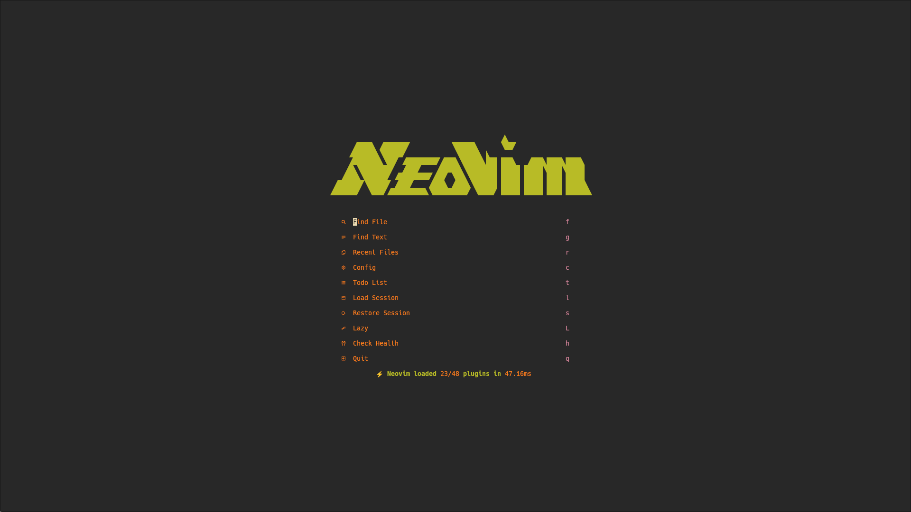
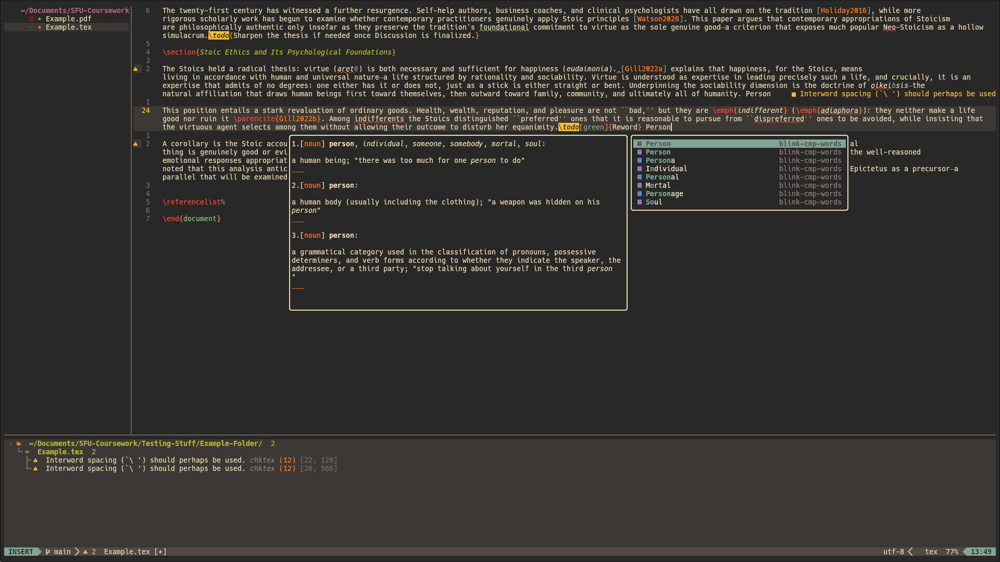
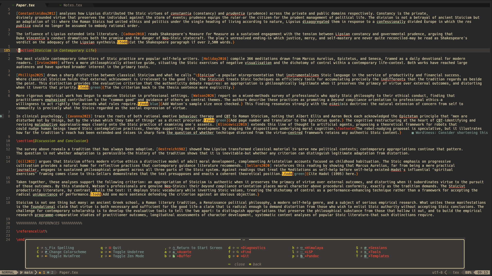

# Neovim





_My Neovim setup for academic writing_

**[Writing Workflow](https://www.youtube.com/watch?v=avbT4fAC3R4) · [Note-Taking](https://www.youtube.com/watch?v=zayVF1j9gBg)**

---

## Features

### Academic & LaTeX

- **VimTeX** — Full LaTeX build system integration with Zathura PDF viewer and forward/inverse search
- **Bibliography management** — Zotero integration via Telescope-BibTeX for inline citation search and insertion
- **Template system** — Pre-configured APA, MLA, and Chicago paper templates with proper document structure
- **Word counting** — Section-by-section word count via VimTeX
- **Spell checking** — Enhanced academic spell checking with custom dictionary support
- **Pandoc integration** — One-command export to DOCX, Markdown, plain text, and MP3 audio

### AI Assistance

- **Avante** — Conversational AI assistant supporting Claude Sonnet, DeepSeek, and Moonshot; context-aware with buffer and repository awareness
- **GitHub Copilot** — Inline code completion in manual trigger mode

### Development

- **LSP** — Comprehensive language server support via Mason: TeXLab (LaTeX), LTeX+ (grammar), Lua LS (Lua), Marksman (Markdown), SQLS (SQL), JSON LS, HTML LS, CSS LS, VTSLS (TypeScript/JavaScript)
- **Blink.cmp** — Fast completion engine with fuzzy matching and dictionary/thesaurus, lsp, and snippet sources
- **Treesitter** — Accurate syntax highlighting and structural navigation
- **Conform.nvim** — Format-on-save with multiple formatters: Stylua (Lua), Prettier/Prettierd (HTML/CSS/JS), LaTeXIndent (LaTeX), MarkdownLint-CLI2 + Markdown-TOC (Markdown)
- **Linting** — Real-time linting with ChkTeX (LaTeX), ESLint (JavaScript), HTMLHint (HTML), Stylelint (CSS), Luacheck (Lua), MarkdownLint (Markdown)

### Interface & Productivity

- **Gruvbox** — Primary colorscheme
- **Which-Key** — Discoverable keymap guide with organized command groups
- **Snacks dashboard** — Custom start screen with session shortcuts
- **Lualine** — Status line
- **Bufferline** - Shows open buffers
- **Zen Mode** — Distraction-free writing environment

---

## Plugin Ecosystem

| Category           | Plugins                                                                                 |
| ------------------ | --------------------------------------------------------------------------------------- |
| **Plugin manager** | lazy.nvim                                                                               |
| AI                 | avante, copilot                                                                         |
| Colorscheme        | gruvbox, catppuccin, rose-pine, vague, tokyonight                                       |
| Editor             | flash, conform, vimtex, trouble, mini-nvim, nvim-ts-autotag, gitsigns, yanky            |
| Keymaps            | which-key                                                                               |
| LSP                | mason, mason-lsp-config, mason-tool-installer, nvim-lspconfig                           |
| UI                 | lualine, bufferline, noice, snacks                                                      |
| Util               | telescope, blink-cmp, luasnip, nvim-tree, nvim-treesitter, vim-tmux-navigator, undotree |
| Misc               | neovim-session-manager, nvim-lint, cloak, vim-dadbod                                    |

---

## Key Mappings

**Leader**: `<Space>` | **Local leader**: `\`

### Core

| Key         | Action               |
| ----------- | -------------------- |
| `<leader>e` | Toggle file explorer |
| `<leader>q` | Quit                 |
| `<leader>,` | Return to dashboard  |
| `<leader>z` | Toggle Zen Mode      |
| `<leader>C` | Browse colorschemes  |
| `<leader>c` | Fix spelling         |

### Find & Navigate

| Key          | Action                    |
| ------------ | ------------------------- |
| `<leader>ff` | Find files                |
| `<leader>ft` | Live grep                 |
| `<leader>fb` | Search buffers            |
| `<leader>fr` | Recent files              |
| `<leader>fz` | Search citations (BibTeX) |
| `<leader>fu` | Visual undo tree          |
| `<leader>fl` | Resume last search        |
| `<leader>fg` | Git history               |
| `<leader>fh` | Help tags                 |
| `<leader>fk` | Keymaps                   |
| `<leader>fy` | Yank history              |
| `<leader>fd` | Diagnostics               |
| `<leader>fm` | Man pages                 |
| `<leader>fc` | Config files              |
| `<leader>fs` | Symbols                   |

### LaTeX

| Key   | Action                |
| ----- | --------------------- |
| `\ll` | Build document        |
| `\lv` | View PDF              |
| `\lW` | Word count by section |
| `\le` | Show errors           |
| `\lc` | Clean auxiliary files |
| `\lC` | Clean full            |
| `\lg` | VimTeX status         |
| `\li` | VimTeX info           |
| `\lk` | Stop compilation      |
| `\lT` | Toggle TOC            |
| `\ld` | Package documentation |

### Templates

| Key           | Template                   |
| ------------- | -------------------------- |
| `<leader>Ta`  | APA paper                  |
| `<leader>TA`  | APA paper (standalone)     |
| `<leader>Tm`  | MLA paper                  |
| `<leader>TM`  | MLA paper (standalone)     |
| `<leader>Tc`  | Chicago paper              |
| `<leader>TC`  | Chicago paper (standalone) |
| `<leader>Tn`  | Notes                      |
| `<leader>TN`  | Notes (standalone)         |
| `<leader>Ts`  | Studying                   |
| `<leader>Tb`  | APA barebones              |
| `<leader>Tf`  | APA figures and tables     |
| `<leader>TWR` | Resume                     |
| `<leader>TWr` | Resume (complete)          |
| `<leader>TWc` | Cover letter               |
| `<leader>TWl` | References                 |
| `<leader>TWt` | Thank you letter           |
| `<leader>TOr` | Recipe                     |
| `<leader>TOl` | Letter                     |

### Export (Pandoc)

| Key          | Format                 |
| ------------ | ---------------------- |
| `<leader>pd` | Word (.docx)           |
| `<leader>pm` | Markdown               |
| `<leader>pt` | LaTeX                  |
| `<leader>pT` | Plain text + MP3 audio |

### AI (Avante)

| Key          | Action                    |
| ------------ | ------------------------- |
| `<leader>aa` | Ask AI                    |
| `<leader>aC` | Start chat                |
| `<leader>at` | Toggle sidebar            |
| `<leader>a?` | Select model              |
| `<leader>aB` | Add all open buffers      |
| `<leader>aR` | Display repo map          |
| `<leader>ac` | Clear chat history        |
| `<leader>ad` | Toggle debug              |
| `<leader>af` | Focus                     |
| `<leader>ah` | Select history            |
| `<leader>am` | Select ACP Mode           |
| `<leader>an` | Create new chat           |
| `<leader>ar` | Refresh                   |
| `<leader>as` | Toggle suggestion         |
| `<leader>aS` | Stop                      |
| `<leader>az` | Toggle Zen Mode           |
| `<leader>a+` | Select file in NvimTree   |
| `<leader>a-` | Deselect file in NvimTree |

### Git

| Key                         | Action               |
| --------------------------- | -------------------- |
| `<leader>gg`                | Open LazyGit         |
| `<leader>gs`                | Git status           |
| `<leader>gb`                | Git branches         |
| `<leader>gc`                | Git commits          |
| `<leader>gj` / `<leader>gk` | Next / previous hunk |
| `<leader>gp`                | Preview hunk         |
| `<leader>gl`                | Blame current line   |

### Buffers & Sessions

| Key                         | Action                          |
| --------------------------- | ------------------------------- |
| `<Tab>` / `<S-Tab>`         | Next / previous buffer          |
| `<leader>bd`                | Close buffer                    |
| `<leader>bn` / `<leader>bp` | Move buffer right / left        |
| `<leader>bP`                | Pin buffer                      |
| `<leader>bf`                | Pick buffer                     |
| `<leader>br` / `<leader>bl` | Close right / left buffers      |
| `<leader>b\` / `<leader>b-` | Split vertically / horizontally |
| `<leader>bq`                | Close window                    |
| `<leader>Ss`                | Save session                    |
| `<leader>Sl`                | Load session                    |
| `<leader>Sd`                | Delete session                  |

### LSP & Tools

| Key          | Action                    |
| ------------ | ------------------------- |
| `<leader>lu` | Mason update              |
| `<leader>ts` | Toggle spell check        |
| `<leader>tc` | Toggle Copilot            |
| `<leader>tC` | Toggle Cloak              |
| `<leader>tf` | Format                    |
| `<leader>tl` | Lint                      |
| `<leader>td` | Toggle LSP virtual text   |

### Diagnostics

| Key          | Action                  |
| ------------ | ----------------------- |
| `<leader>dp` | Project Diagnostics     |
| `<leader>db` | Buffer Diagnostics      |
| `<leader>ds` | Symbols (Trouble)       |
| `<leader>dq` | Quickfix List (Trouble) |
| `<leader>dd` | Open diagnostic under cursor |

---

## Installation

### Directory Structure

```
nvim/
├── init.lua                    # Entry point
├── lua/
│   ├── config/
│   │   ├── lazy.lua            # Plugin manager bootstrap
│   │   ├── options.lua         # Core Neovim settings (Used LazyVim deafults and Gilles Castel's spell check keymap)
│   │   └── icons.lua           # Icons
│   ├── plugins/                # Plugin configuration files
│   │   ├── ai.lua
│   │   ├── colorscheme.lua
│   │   ├── editor.lua
│   │   ├── keymaps.lua
│   │   ├── lsp.lua
│   │   ├── misc.lua
│   │   ├── ui.lua
│   │   └── util.lua
│   └── snippets/               # Custom LuaSnip snippets
│       ├── tex.lua
        └── lua.lua
├── screenshots/                # Documentation screenshots
├── spell/                      # Custom spell dictionaries
│   ├── en.utf-8.add
│   └── en.utf-8.add.spl
└── templates/                  # LaTeX document templates
    ├── APA-*.tex
    ├── MLA-*.tex
    ├── Chicago-*.tex
    ├── Notes*.tex
    ├── Resume.tex
    ├── Resume.tex
    ├── Cover-Letter.tex
    ├── Letter.tex
    ├── Recipe.tex
    ├── References.tex
    ├── Studying.tex
    └── Thank-You.tex
```

### Prerequisites

| Dependency                                    | Purpose                             |
| --------------------------------------------- | ----------------------------------- |
| Neovim 0.12+                                  | Required                            |
| Git                                           | Plugin management                   |
| Hack Nerd Font                                | Icons                               |
| Kitty, Wezterm, Alacritty, Ghostty, or iTerm2 | For image support                   |
| Node.js 18+                                   | LSP server support                  |
| Python 3.8+                                   | Code formatting tools               |
| Java 17+                                      | LTeX grammar checking server        |
| Texlive                                       | LaTeX compilation                   |
| Zotero + Better BibTeX plugin                 | Citations                           |
| Zathura                                       | PDF preview                         |
| Pandoc                                        | Document conversion                 |
| ripgrep, fd                                   | Fast file searching                 |
| aspell                                        | Word suggestions                    |
| espeak-ng and ffmpeg (optional)               | Mp3 conversion                      |
| Rust (optional)                               | Better performance for some plugins |

### Steps

**1. Back up your existing configuration:**

```bash
mv ~/.config/nvim ~/.config/nvim.backup
```

**2. Clone this repository:**

```bash
git clone https://github.com/GossieDog/nvim.git ~/.config/nvim
```

**3. Launch Neovim:**

```bash
nvim
```

Lazy.nvim will automatically bootstrap and install all plugins on first launch.

Mason will automatically install lsp servers and tools. Treesitter will automatically install parsers.

### Post-Install Checklist

- [ ] Open Neovim and wait for Lazy.nvim to finish installing plugins
- [ ] Run `:Mason` and confirm everything is installed.
- [ ] Run checkhealth
- [ ] Start a keep updated auto-export for your whole Zotero libaray using the BetterBibTeX for Zotero plugin.
- [ ] Update the bibliography path in the Telescope-BibTeX configuration
- [ ] Run `:Copilot auth` if using GitHub Copilot
- [ ] Set up API keys for Avante (`ANTHROPIC_API_KEY`, `DEEPSEEK_API_KEY`, `MOONSHOT_API_KEY`)
- [ ] Install vim-tmux-navigator in tmux with tpm (or manually)

- [ ] Add any additional plugins in the plugins directory.
