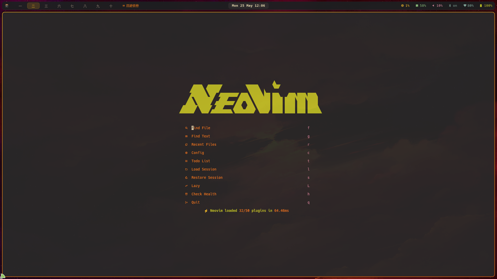
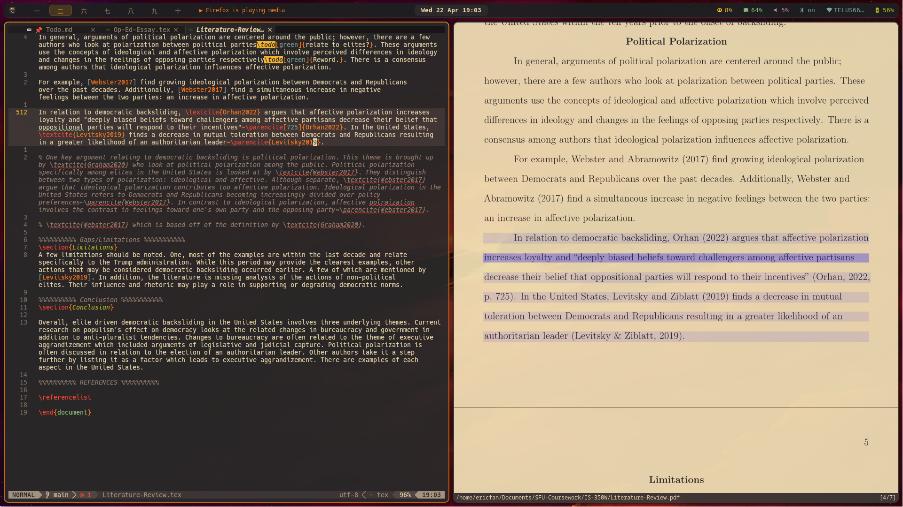
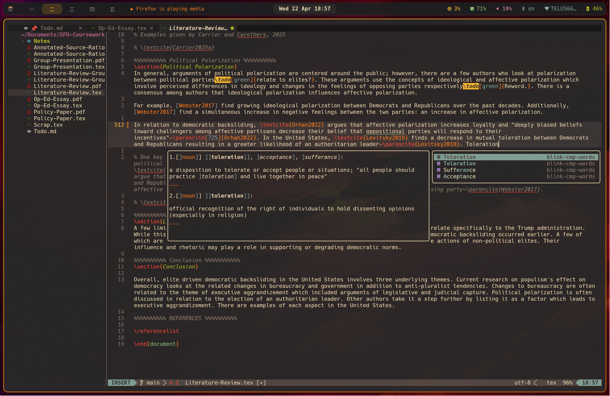

# Neovim Academic Configuration

> A modern Neovim setup built for academic writing, LaTeX development, and research — combining a full IDE experience with AI assistance and scholarly productivity tools.

## 📸 Screenshots


_Welcome screen featuring the Snacks dashboard with project shortcuts, recent files, and quick session access — your academic workspace starts here._


_Active LaTeX editing environment with VimTeX integration, showing real-time compilation feedback and document structure navigation._


_Integrated file tree and buffer management in action, demonstrating the seamless workflow between project navigation and document editing._

---

## Demonstrations

- [Writing](https://www.youtube.com/watch?v=avbT4fAC3R4)
- [Notes](https://www.youtube.com/watch?v=zayVF1j9gBg)

---

## Contents

- [Overview](#overview)
- [Features](#features)
- [Plugin Ecosystem](#plugin-ecosystem)
- [Key Mappings](#key-mappings)
- [Installation](#installation)
- [Configuration](#configuration)
- [Usage](#usage)
- [Customization](#customization)

---

## Overview

This configuration is optimized for users who split their time between academic writing and software development. It provides first-class LaTeX support via VimTeX, citation management through Zotero/BibTeX, AI-powered assistance via Avante and GitHub Copilot, and a full LSP-backed development environment — all within a carefully organized, modular structure.

**Primary use cases:**

- Writing and compiling LaTeX documents (research papers, theses, reports)
- Managing citations and bibliographies
- Converting documents across formats (DOCX, Markdown, audio)
- General software development with LSP, linting, and formatting

---

## Features

### Academic & LaTeX

- **VimTeX** — Full LaTeX build system integration with Zathura PDF viewer and forward/inverse search
- **Bibliography management** — Zotero integration via Telescope-BibTeX for inline citation search and insertion
- **Template system** — Pre-configured APA, MLA, and Chicago paper templates with proper document structure
- **Word counting** — Section-by-section word count via VimTeX
- **Spell checking** — Enhanced academic spell checking with custom dictionary support
- **Pandoc integration** — One-command export to DOCX, Markdown, plain text, and MP3 audio

### AI Assistance

- **Avante** — Conversational AI assistant supporting Claude Sonnet, DeepSeek, and Moonshot; context-aware with buffer and repository awareness
- **GitHub Copilot** — Inline code completion in manual trigger mode

### Development

- **LSP** — TeXLab for LaTeX; extensible to any language via Mason
- **Blink.cmp** — Fast completion engine with fuzzy matching and dictionary/thesaurus sources
- **Treesitter** — Accurate syntax highlighting and structural navigation
- **Conform.nvim** — Format-on-save for all supported filetypes
- **ChkTeX** — Real-time LaTeX linting

### Interface & Productivity

- **Gruvbox** — Dark-optimized primary colorscheme (alternatives: Catppuccin, Rose Pine, Vague)
- **Which-Key** — Discoverable keymap guide with organized command groups
- **Snacks dashboard** — Custom start screen with project and session shortcuts
- **Lualine** — Status line with VimTeX word count and real-time clock
- **Zen Mode** — Distraction-free writing environment
- **Cloak** — Hide sensitive information in specific files (e.g., environment variables, personal notes)

---

## Plugin Ecosystem

| Category           | Plugins                                                      |
| ------------------ | ------------------------------------------------------------ |
| **Plugin manager** | lazy.nvim                                                    |
| **UI & dashboard** | snacks.nvim, lualine.nvim, which-key.nvim                    |
| **Completion**     | blink.cmp, LuaSnip, friendly-snippets                        |
| **LaTeX**          | VimTeX, telescope-bibtex.nvim, ChkTeX                        |
| **LSP & tooling**  | nvim-lspconfig, mason.nvim, conform.nvim, nvim-treesitter    |
| **AI**             | avante.nvim, copilot.lua                                     |
| **Navigation**     | telescope.nvim, nvim-tree.lua, flash.nvim                    |
| **Git**            | gitsigns.nvim, lazygit                                       |
| **Utilities**      | mini.nvim, yanky.nvim, undotree, session-manager, cloak.nvim |

---

## Key Mappings

**Leader**: `<Space>` | **Local leader**: `\`

### Core

| Key         | Action               |
| ----------- | -------------------- |
| `<leader>e` | Toggle file explorer |
| `<leader>w` | Save all buffers     |
| `<leader>q` | Quit                 |
| `<leader>,` | Return to dashboard  |
| `<leader>z` | Toggle Zen Mode      |
| `<leader>C` | Browse colorschemes  |
| `<leader>c` | Fix spelling         |

### Find & Navigate

| Key          | Action                    |
| ------------ | ------------------------- |
| `<leader>ff` | Find files                |
| `<leader>ft` | Live grep                 |
| `<leader>fb` | Search buffers            |
| `<leader>fr` | Recent files              |
| `<leader>fz` | Search citations (BibTeX) |
| `<leader>fu` | Visual undo tree          |
| `<leader>fl` | Resume last search        |
| `<leader>fg` | Git history               |
| `<leader>fh` | Help tags                 |
| `<leader>fk` | Keymaps                   |
| `<leader>fy` | Yank history              |
| `<leader>fd` | Diagnostics               |
| `<leader>fm` | Man pages                 |
| `<leader>fc` | Config files              |

### LaTeX

| Key   | Action                 |
| ----- | ---------------------- |
| `\ll` | Build document         |
| `\lv` | View PDF               |
| `\lW` | Word count in sections |
| `\le` | Show errors            |
| `\lc` | Clean auxiliary files  |
| `\lC` | Clean full             |
| `\lg` | VimTeX status          |
| `\li` | VimTeX info            |
| `\lk` | Stop compilation       |
| `\lT` | Toggle TOC             |
| `\ld` | Package documentation  |

### Templates

| Key           | Template                   |
| ------------- | -------------------------- |
| `<leader>Ta`  | APA paper                  |
| `<leader>TA`  | APA paper (standalone)     |
| `<leader>Tm`  | MLA paper                  |
| `<leader>TM`  | MLA paper (standalone)     |
| `<leader>Tc`  | Chicago paper              |
| `<leader>TC`  | Chicago paper (standalone) |
| `<leader>Tn`  | Notes                      |
| `<leader>TN`  | Notes (standalone)         |
| `<leader>Ts`  | Studying                   |
| `<leader>Tb`  | APA barebones              |
| `<leader>Tf`  | APA figures and tables     |
| `<leader>TWr` | Resume                     |
| `<leader>TWc` | Cover letter               |
| `<leader>TOr` | Recipe                     |

### Export (Pandoc)

| Key          | Format                 |
| ------------ | ---------------------- |
| `<leader>pd` | Word (.docx)           |
| `<leader>pm` | Markdown               |
| `<leader>pt` | LaTeX                  |
| `<leader>pT` | Plain text + MP3 audio |

### AI (Avante)

| Key          | Action                    |
| ------------ | ------------------------- |
| `<leader>aa` | Ask AI                    |
| `<leader>aC` | Start chat                |
| `<leader>at` | Toggle sidebar            |
| `<leader>a?` | Select model              |
| `<leader>aB` | Add all open buffers      |
| `<leader>aR` | Display repo map          |
| `<leader>ac` | Clear chat history        |
| `<leader>af` | Focus                     |
| `<leader>ah` | Select history            |
| `<leader>an` | Create new chat           |
| `<leader>ar` | Refresh                   |
| `<leader>aS` | Stop                      |
| `<leader>az` | Toggle zen mode           |
| `<leader>a+` | Select file in NvimTree   |
| `<leader>a-` | Deselect file in NvimTree |

### Git

| Key                         | Action               |
| --------------------------- | -------------------- |
| `<leader>gg`                | Open LazyGit         |
| `<leader>gs`                | Git status           |
| `<leader>gb`                | Git branches         |
| `<leader>gc`                | Git commits          |
| `<leader>gj` / `<leader>gk` | Next / previous hunk |
| `<leader>gp`                | Preview hunk         |
| `<leader>gl`                | Blame current line   |

### Buffers & Sessions

| Key                         | Action                          |
| --------------------------- | ------------------------------- |
| `<Tab>` / `<S-Tab>`         | Next / previous buffer          |
| `<leader>bd`                | Close buffer                    |
| `<leader>bn` / `<leader>bp` | Move buffer right / left        |
| `<leader>bP`                | Pin buffer                      |
| `<leader>bf`                | Pick buffer                     |
| `<leader>br` / `<leader>bl` | Close right / left buffers      |
| `<leader>bv` / `<leader>bh` | Split vertically / horizontally |
| `<leader>bq`                | Close window                    |
| `<leader>Ss`                | Save session                    |
| `<leader>Sl`                | Load session                    |
| `<leader>Sd`                | Delete session                  |

### LSP & Tools

| Key                         | Action                     |
| --------------------------- | -------------------------- |
| `<leader>lu`                | Mason update               |
| `<leader>lf`                | Telescope diagnostics      |
| `<leader>ln` / `<leader>lp` | Next / previous diagnostic |
| `<leader>ts`                | Toggle spell check         |
| `<leader>tc`                | Toggle Copilot             |
| `<leader>tC`                | Toggle Cloak               |

### Email (Himalaya)

| Key                         | Action               |
| --------------------------- | -------------------- |
| `<leader>hh`                | Open default account |
| `<leader>ho`                | Open account         |
| `<leader>hw`                | Write email          |
| `<leader>hr`                | Reply                |
| `<leader>hR`                | Reply all            |
| `<leader>ha`                | Download attachments |
| `<leader>hd`                | Delete               |
| `<leader>hf`                | Forward              |
| `<leader>hm` / `<leader>hM` | Add / remove flag    |

---

## Installation

### Prerequisites

| Dependency             | Purpose                   |
| ---------------------- | ------------------------- |
| Neovim 0.9+            | Required                  |
| Git                    | Plugin management         |
| Node.js                | LSP server support        |
| TeX Live (recommended) | LaTeX compilation         |
| Zathura                | PDF preview               |
| Pandoc                 | Document conversion       |
| ripgrep, fd            | Telescope search backends |

### Steps

**1. Back up your existing configuration:**

```bash
mv ~/.config/nvim ~/.config/nvim.backup
```

**2. Clone this repository:**

```bash
git clone <repository-url> ~/.config/nvim
```

**3. Launch Neovim:**

```bash
nvim
```

Lazy.nvim will automatically bootstrap and install all plugins on first launch.

**4. Install LSP servers via Mason (optional):**

```vim
:Mason
```

### System Dependencies

```bash
# LaTeX
sudo apt install texlive-full latexmk zathura

# Search tools
sudo apt install ripgrep fd-find pandoc

# Spell checking
sudo apt install aspell aspell-en

# Text-to-speech export
sudo apt install espeak-ng ffmpeg
```

### Post-Install Checklist

- [ ] Open Neovim and wait for Lazy.nvim to finish installing plugins
- [ ] Run `:Mason` and confirm TeXLab is installed
- [ ] Create a `.tex` file and compile with `\ll`
- [ ] Update the bibliography path in the Telescope-BibTeX configuration
- [ ] Run `:Copilot auth` if using GitHub Copilot
- [ ] Verify Avante is working with `<leader>aa`

---

## Configuration

### Directory Structure

```
nvim/
├── init.lua                    # Entry point
├── lazy-lock.json             # Plugin version lock file
├── lazyvim.json               # LazyVim configuration
├── lua/
│   ├── config/
│   │   ├── lazy.lua            # Plugin manager bootstrap
│   │   └── options.lua         # Core Neovim settings
│   ├── plugins/                # Per-plugin configuration files
│   │   ├── ai.lua              # AI plugins (Avante, Copilot)
│   │   ├── colorscheme.lua     # Color scheme configurations
│   │   ├── editing.lua         # Text editing enhancements
│   │   ├── keymaps.lua         # Custom key mappings
│   │   ├── lsp.lua             # LSP and language server setup
│   │   ├── misc.lua            # Miscellaneous plugins
│   │   ├── ui.lua              # UI plugins and dashboard
│   │   └── utils.lua           # Utility plugins
│   └── snippets/               # Custom LuaSnip snippets
│       └── tex.lua             # LaTeX-specific snippets
├── screenshots/                # Documentation screenshots
├── spell/                      # Custom spell dictionaries
│   ├── en.utf-8.add           # Custom word additions
│   └── en.utf-8.add.spl       # Compiled spell file
└── templates/                  # LaTeX document templates
    ├── APA-*.tex              # APA format templates
    ├── MLA-*.tex              # MLA format templates
    ├── Chicago-*.tex          # Chicago format templates
    ├── Notes*.tex             # Note-taking templates
    ├── Resume.tex             # Resume template
    ├── Cover-Letter.tex       # Cover letter template
    ├── Letter.tex             # General letter template
    ├── Recipe.tex             # Recipe template
    ├── References.tex         # References template
    ├── Studying.tex           # Study notes template
    └── Thank-You.tex          # Thank you letter template
```

### Key Settings

| Setting             | Value                      |
| ------------------- | -------------------------- |
| Leader key          | `<Space>`                  |
| Local leader        | `\`                        |
| PDF viewer          | Zathura                    |
| Primary colorscheme | Gruvbox (dark)             |
| Primary AI model    | Claude Sonnet (via Avante) |
| Copilot mode        | Manual trigger             |

### LaTeX-Specific Surround Shortcuts

Using `gsa` + key in Mini.surround:

| Key | Output                                |
| --- | ------------------------------------- |
| `e` | `\begin{equation}...\end{equation}`   |
| `A` | `\begin{align}...\end{align}`         |
| `I` | `\begin{itemize}...\end{itemize}`     |
| `E` | `\begin{enumerate}...\end{enumerate}` |
| `b` | `\textbf{...}`                        |
| `i` | `\textit{...}`                        |
| `$` | `$...$`                               |

---

## Usage

### Writing an Academic Paper

```bash
mkdir ~/papers/my-paper && cd ~/papers/my-paper
nvim paper.tex
```

1. Load a template with `<leader>T` (`a` for APA, `m` for MLA, `c` for Chicago)
2. Search and insert citations with the completion menus or `<leader>fz`
3. Compile with `\ll` and preview with `\lv`

### Working with Citations

Open the BibTeX picker with `<leader>fz`, then:

| Key       | Action                                    |
| --------- | ----------------------------------------- |
| `<Enter>` | Insert citation key — `\cite{author2023}` |
| `<C-e>`   | Insert full bibliography entry            |
| `<C-c>`   | Insert formatted inline citation          |

### Using AI Assistance

- **Ask about selected text**: Visual-select, then `<leader>aa`
- **Open persistent chat**: `<leader>aC`
- **Add open buffers as context**: `<leader>aB`
- **Switch models**: `<leader>a?` (Claude, DeepSeek, Moonshot)

### Privacy & Security with Cloak

Cloak automatically hides sensitive content in specified files. Use `<leader>tC` to toggle visibility:

- **Practice journals** — Configured to hide content in `Practice-Journal.tex`
- **Environment files** — Hides export statements in `.zshrc`
- **Custom patterns** — Add your own file patterns and cloak rules in `lua/plugins/cloak.lua`

---

## Customization

| What to change           | Where                       |
| ------------------------ | --------------------------- |
| Add or configure plugins | `lua/plugins/`              |
| Modify keymaps           | `lua/plugins/which-key.lua` |
| Add LaTeX templates      | `templates/`                |
| Add snippets             | `lua/snippets/`             |
| Change core settings     | `lua/config/options.lua`    |

---

## Troubleshooting

**PDF not updating after compile** — Run `\le` to check for compilation errors. Clean auxiliary files with `\lc` and recompile.

**Completions not appearing** — Run `:LspInfo` to confirm the language server is active. For dictionary completions, ensure `aspell` and `aspell-en` are installed.

**Avante not responding** — Verify your API key is set correctly in your environment. Check your internet connection.

**Copilot not working** — Run `:Copilot status`. Re-authenticate with `:Copilot auth` if needed.

<!-- --- -->

<!-- ## License -->
<!---->
<!-- MIT License — see [LICENSE](LICENSE) for details. -->
